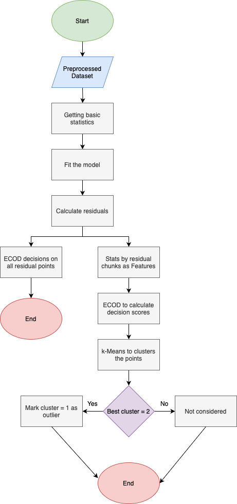

# time_series_analysis
# Thesis Work  
**Title:** Exploring ARIMA and TimeGAN Combined with ECOD for Anomaly Detection in Time Series: A Focus on RealKnownCause in the NAB Dataset  

Exploring how to use ARIMA and TimeGAN to capture temporal dependencies. 

Once done, calculate the residuals between the predicted value and original one. 

Apply ECOD based on the residuals to see which one works better in terms of capturing true outliers. 

The process is visualized as below: 

The sequence length of this is on a daily basis. 

NAB dataset: [Source](https://github.com/numenta/NAB)

The code of TimeGAN is originally provided by Yoon et al. - [Source](https://github.com/jsyoon0823/TimeGAN)
* Note that the code has been refactored to work with latest tensorflow v2.18. The original code was written in the old version. 
 